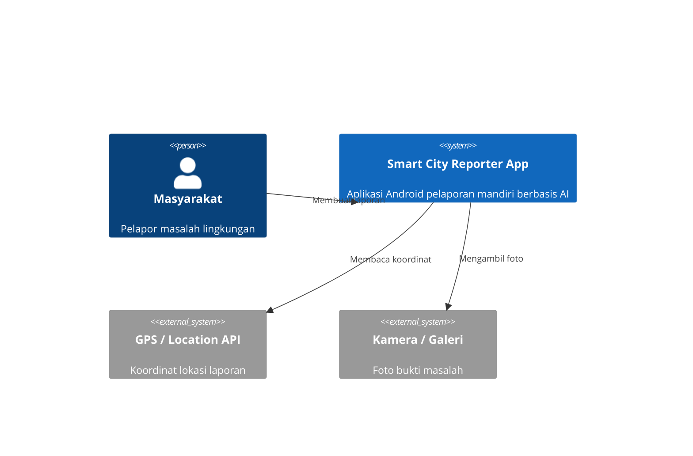

# Thesis Completion Plan
> Working directory: `/Users/quatumteknologinusantara/Thesis-`
> Last updated: 2026-04-14

---

## Critical Context: The Architecture Pivot

The biggest risk in the thesis right now is a **fundamental mismatch** between what is written and what was actually built. The thesis must be corrected to reflect reality before any expansion work begins.

| Dimension | What Bab1–3 Currently Say | What Was Actually Built |
|---|---|---|
| AI Models | DINOv2, ViT, ResNet101 (image) + E5, IndoBERT, FastText (text) | ConvNeXtV2, EfficientViT, MambaOut, Hiera, EVA-02 (image only, via `timm`) |
| Modality | Multimodal: image + text fusion | Unimodal: image classification only |
| Deployment | Web application / REST API | Flutter Android app with on-device ONNX inference |
| Dataset source | HuggingFace Hub (Programmer-RD-AI/road-issues-detection-dataset) | ✓ Correct in CLAUDE.md — but Bab3 says "web scraping crm.jakarta.go.id" |
| Best model | Not yet stated in thesis | `mambaout_tiny` — test macro F1: **0.9917** |
| Primary metric | Accuracy (Bab3 states this) | `macro_f1` drives checkpoint selection in code — accuracy is secondary |
| Routing | Vague, "AI assigns to agency" | Specific `classification_routing.dart` with 4 clusters + Indonesian agency names |

Every chapter must be written with the **actually-built system** as ground truth.

---

## Phase 0: Infrastructure Fixes (Do First)

These are blockers — the document will not compile correctly until they are fixed.

### 0.1 Fix `main.tex` bibliography path
- **Problem**: `\bibliography{/home/veinmahzy/skrispi/references/references}` — absolute path to a different machine.
- **Fix**: Change to `\bibliography{references/references}` (relative to `Docs/`).

### 0.2 Fix image paths in `Bab3.tex`
- **Problem**: `\includegraphics[...]{/home/veinmahzy/skrispi/images/bab_3/...}` — absolute paths to a different machine.
- **Fix**: Update `\graphicspath` in `main.tex` to include `{images/bab_3/}` and use relative filenames in Bab3. Alternatively generate new diagrams to replace these entirely (see Phase 3).

### 0.3 Verify `Docs/main.tex` chapter includes
- Current: `\include{chapters/bab1}`, `\include{chapters/bab2}`, `\include{chapters/bab3}` (lowercase). File names on disk are `Bab1.tex`, `Bab2.tex`, `Bab3.tex` (capital B). On macOS (case-insensitive FS) this compiles; on Linux it will fail. Rename to lowercase or standardize.

---

## Phase 1: Rewrite Bab 1 — Pendahuluan

**Goal**: Keep the smart city motivation and public reporting problem. Update the technology narrative to match what was built (image AI on mobile, not multimodal web AI).

### 1.1 Latar Belakang
Keep and expand:
- The governance bottleneck (2-hour average manual triage time) — this is the core motivation, keep it.
- The limitation of text/form-only systems lacking visual evidence.
- The need for visual AI in reporting.

**Remove**: The paragraph that references Multilingual E5 and DINOv2 specifically as the chosen solution (this belongs in Bab 2 comparison, not the introduction). The introduction should reference "deep learning-based image classification" generically.

**Add**:
- A paragraph on the rise of mobile-first civic tech: citizens use smartphones, therefore the AI should run on the device — reducing server cost, enabling offline-capable classification, and protecting privacy (no image upload to a server for classification).
- A brief paragraph on the evolution of lightweight vision models (MobileNet → EfficientNet → State Space Models) enabling on-device deep learning.
- Statistical justification: cite smartphone penetration in Indonesia or a smart city adoption stat.

### 1.2 Rumusan Masalah
Replace question 3 ("sejauh mana integrasi gambar dan teks...") since text integration is no longer in scope. New questions:
1. How to design a mobile-first environmental problem reporting system that integrates on-device AI?
2. How to select and fine-tune an optimal lightweight vision backbone from the ConvNeXtV2/EfficientViT/MambaOut/Hiera/EVA-02 family for 8-class road-issue classification?
3. How to deploy a trained model as ONNX to an Android app while preserving inference accuracy?
4. How to design an automated agency routing mechanism based on AI classification results?

### 1.3 Ruang Lingkup
Update the 8 classes to match the actual dataset:
- Current dataset labels (from HuggingFace): `Accident Issues`, `Littering Garbage on Public Places Issues`, `Vandalism Issues`, `Pothole Issues`, `Damaged Road issues`, `Broken Road Sign Issues`, `Fallen Tree Issues` — **excluding** `Illegal Parking Issues` and `Mixed Issues`.
- Note clearly: text description is collected for context only, not fed into the AI classifier.
- Note clearly: system runs as a **mobile Android application**, not a web portal.

### 1.4 Tujuan dan Manfaat
Update objective (b): change from "transformer classification + web dashboard" to "comparative benchmark of 5 modern vision backbones → export winner to ONNX → embed in Flutter app."

### 1.5 Metode Penelitian (overview)
The sub-section on "Pengembangan Website" must be renamed "Pengembangan Aplikasi Mobile" and describe the Flutter + Riverpod + sqflite stack and the ONNX Runtime integration.

---

## Phase 2: Overhaul Bab 2 — Tinjauan Pustaka

**Goal**: Replace the entire AI models section with coverage of the models that were actually used. Keep the Smart City, public reporting, and Transformer foundations — these are still academically valid context.

### 2.1 Keep (minor edits only)
- Section 2.1: Smart City & Smart Environment — keep as is, add 1–2 newer citations.
- Section 2.2: Sistem Pelaporan & Partisipasi Publik — keep as is.
- Section 2.3: Transformer architecture overview — keep but move the ViT sub-section here.

### 2.2 Remove Entirely
- DINOv2 sub-section (Section 2.3.2 currently)
- Multilingual E5 sub-section
- IndoBERT sub-section
- FastText sub-section
- The "Embeddings" section (Section 2.3 currently — no longer relevant since text embeddings are not used)

### 2.3 Add: Image Classification Backbone Survey
Write one sub-section per model actually used in the experiment. For each model provide:
- Architecture overview (what makes it different from vanilla ViT)
- Key technical contribution / innovation
- Why it is relevant as a candidate for on-device or lightweight deployment
- BibTeX citation

#### 2.3.1 ConvNeXt V2 (2023)
- Citation: Liu et al., 2023. `arxiv:2301.00808`
- Key: Pure ConvNet modernized with masked autoencoder co-design (FCMAE). No attention mechanism. Efficient. Globally competitive with ViT at small scales.

#### 2.3.2 EfficientViT-B (2023)
- Citation: Liu et al., 2023. `arxiv:2205.14756`
- Key: Efficient multi-scale linear attention. Designed explicitly for fast inference on hardware. Good throughput/accuracy tradeoff.

#### 2.3.3 MambaOut Tiny (2024) ← **the winning model**
- Citation: Yu et al., 2024. `arxiv:2405.07992`
- Key: Uses Mamba-style gated state-space operators but without the SSM scan — resulting in a pure-CNN-like model with global context capture. Achieves strong visual recognition without attention. Tiny variant suitable for ONNX export.
- Must emphasize: achieved **test macro F1 = 0.9917** in this experiment.

#### 2.3.4 Hiera (Hierarchical Vision Transformer, 2023)
- Citation: Ryali et al., 2023. `arxiv:2306.00989`
- Key: Removes positional embeddings from ViT, uses hierarchical pooling from masked autoencoders. Simple and fast.

#### 2.3.5 EVA-02 (2023)
- Citation: Fang et al., 2023. `arxiv:2303.11331`
- Key: Vision foundation model pre-trained with masked image modeling (MIM) + CLIP alignment. Strong semantic features. Even the tiny variant carries rich pre-trained knowledge.

### 2.4 Add: ONNX and On-Device Inference
New sub-section covering:
- What ONNX is: open standard for model interchange (PyTorch → ONNX).
- ONNX Runtime: cross-platform inference engine. Android support via `onnxruntime-android` AAR.
- Opset 17: what it means, why it was chosen.
- Constant folding during export — what it does and why.
- Metadata JSON pattern: why the companion `.metadata.json` is needed to decode class names on the app side.
- Cite: ONNX Runtime paper or official documentation.

### 2.5 Add: Flutter & Mobile Architecture
New sub-section covering:
- Flutter: cross-platform UI framework. Dart language. Why relevant for rapid Android prototyping.
- Riverpod: compile-time safe reactive state management.
- GoRouter: declarative navigation.
- sqflite: local SQLite database for fully offline operation (no backend server required).
- Cite: Flutter documentation, Riverpod paper or official.

### 2.6 Update: Vision Transformer (ViT) sub-section
Keep ViT in Bab 2 but reframe it as **foundational context** (most of the modern backbones above build on or diverge from ViT). Remove the claim that ViT was used directly in the experiment.

---

## Phase 3: Complete Bab 3 — Metode Penelitian

This chapter needs the most work. The current draft is incomplete (ends abruptly at the model table) and describes a system that does not match the implementation.

### 3.1 Kerangka Berpikir (Framework)
Replace the broken absolute image path with either:
- A Mermaid diagram embedded as text (convert to PDF via CLI before submission), OR
- Re-upload the image to `Docs/images/bab_3/` and use a relative path.

The framework should now reflect the actual flow:
```
Problem Analysis → Dataset Collection (HuggingFace) → Data Preprocessing & Augmentation
→ Multi-Model Benchmark (5 models × 8 epochs) → Best Model Selection (mambaout_tiny)
→ ONNX Export → Flutter App Integration → User Testing
```

### 3.2 Dataset
Rewrite the dataset section completely:

**Source**: HuggingFace Hub — `Programmer-RD-AI/road-issues-detection-dataset`
- Downloaded via `huggingface_hub.snapshot_download()`
- Not web-scraped from crm.jakarta.go.id (remove that claim)

**Class labels used (8 classes)**:
- Accident Issues
- Littering Garbage on Public Places Issues
- Vandalism Issues
- Pothole Issues
- Damaged Road issues
- Broken Road Sign Issues
- Fallen Tree Issues
- *(plus one more to make 8 — verify from the dataset manifest)*

**Excluded labels**: `Illegal Parking Issues`, `Mixed Issues` — excluded because they overlap semantically or are ambiguous.

**Balancing strategy**:
- Target: 800 samples per class (`target_samples_per_class: 800`)
- `BalancedClassSampler` used during training (oversamples minority classes per-batch)
- `minority_boost: true` — minority classes (< 60% of target) receive heavier augmentation transforms
- Group-aware stratified split: augmented accident images have a `__source__` group key to prevent data leakage across train/val/test splits

**Split ratios**: train 70% / val 15% / test 15% — seed 42

**Augmentation pipeline** (training transform):
- Random horizontal/vertical flip
- Random crop / resize
- Color jitter
- Normalization per `timm` model's `data_config` (mean/std differ per backbone)

### 3.3 Eksperimen AI — Detail Lengkap

**Hardware**: GPU (CUDA), with `amp: true` (automatic mixed precision FP16)

**Training configuration** (canonical benchmark: `balanced_800_all_models_accident_augmented.yaml`):

| Hyperparameter | Value |
|---|---|
| Optimizer | AdamW |
| Learning rate | 3e-4 |
| Weight decay | 0.05 |
| Label smoothing | 0.05 |
| Gradient clip norm | 1.0 |
| Max epochs | 8 |
| Batch size | 24 |
| Early stopping patience | 3 epochs |
| Drop path rate | 0.1 |
| LR scheduler | CosineAnnealingLR |
| AMP | FP16 (CUDA only) |
| Pretrained weights | Yes (ImageNet via timm) |

**Model checkpoint selection criterion**: best `val_macro_f1` (not accuracy — this is a key distinction since the thesis currently says accuracy is primary; update the Metrik Evaluasi sub-section below).

**Models benchmarked**:
1. `convnextv2_tiny` (ConvNet family)
2. `efficientvit_b2` (Efficient Transformer family)
3. `mambaout_tiny` (Hybrid State Space family)
4. `hiera_tiny_224` (Hierarchical ViT family)
5. `eva02_tiny_patch14_224` (Foundation ViT family)

All weights loaded from `timm` library with ImageNet pre-training.

### 3.4 Metrik Evaluasi — REWRITE
**Critical correction**: The current Bab3 states accuracy is the primary metric. The training code selects checkpoints based on `val_macro_f1` and the leaderboard sorts by `test_macro_f1`. The thesis must reflect this.

Include all computed metrics:
- **Macro F1-score** (primary — checkpoint selection and ranking)
- Accuracy
- Balanced Accuracy
- Macro ROC-AUC, Weighted ROC-AUC, Micro ROC-AUC
- Per-class Precision, Recall, F1

Explain *why* macro F1 is preferred over accuracy for imbalanced multi-class problems. Even with the 800-sample balancing, macro F1 is more informative because it gives equal weight to all classes regardless of size.

Provide confusion matrix formula and ROC-AUC definition.

### 3.5 Arsitektur Sistem Flutter App
Write a new section covering the full system architecture:

**Sub-sections needed**:

#### 3.5.1 System Overview (C4 — Context Diagram)
Produce Mermaid diagram. Actors: `Masyarakat (Reporter)`, `Instansi Pemerintah (Admin view)`. System: Smart City Reporter Android App. External systems: GPS / Location Services, Camera / Gallery, Local Filesystem.



#### 3.5.2 Container Diagram (C4)
Inside the app:
- Flutter UI Layer (Dart/Riverpod)
- ONNX Inference Engine (`on_device_ai_classification_service.dart`)
- Local Database (`local_database_service.dart` — sqflite: tables `users`, `reports`, `report_history`)
- File Storage (`local_file_storage_service.dart` — profile + report images)
- Location Service (`location_service.dart`)
- Routing Engine (`classification_routing.dart` — 4 clusters)
- ONNX Model Asset (`mambaout_tiny.onnx` + `mambaout_tiny.metadata.json`)

#### 3.5.3 Component Diagram (C4 — Reports Feature)
The `reports` feature is the core. Decompose:
- `create_report_screen.dart` — camera/gallery + GPS capture
- `on_device_ai_classification_service.dart` — ONNX Runtime bridge
- `ai_result_review_screen.dart` — confidence display, manual category correction, map pin
- `classification_routing.dart` — agency recommendation logic

#### 3.5.4 Use Case Diagram (UML — Mermaid)
Actors: Masyarakat, Sistem AI
Use cases:
- Registrasi / Login (local auth)
- Buat Laporan (foto + GPS + AI klasifikasi)
- Tinjau Hasil AI (confidence, manual override)
- Submit Laporan (disimpan di SQLite lokal)
- Lihat Riwayat Laporan
- Lihat Rekomendasi Instansi

#### 3.5.5 Sequence Diagram — Alur Klasifikasi AI (UML — Mermaid)
```
User -> CreateReportScreen : ambil foto (kamera/galeri)
CreateReportScreen -> OnDeviceAIService : classify(imagePath)
OnDeviceAIService -> ONNXRuntime : run inference (mambaout_tiny.onnx)
ONNXRuntime --> OnDeviceAIService : logits [8 classes]
OnDeviceAIService --> CreateReportScreen : AiPrediction (category, confidence, top_predictions)
CreateReportScreen -> AiResultReviewScreen : navigasi dengan hasil
AiResultReviewScreen -> ClassificationRoutingGuidance : buildRoutingGuidance(prediction)
ClassificationRoutingGuidance --> AiResultReviewScreen : agencies, cluster, operationalLabel
User -> AiResultReviewScreen : konfirmasi / koreksi kategori
AiResultReviewScreen -> LocalDatabaseService : saveReport()
```

#### 3.5.6 Class Diagram — Domain Model (UML — Mermaid)
Key classes:
- `Report` (id, userId, category, description, latitude, longitude, imagePath, createdAt, status)
- `User` (id, name, email, password hash, profileImagePath)
- `AiPrediction` (category: IssueCategory, confidence: double, rawPayload: Map)
- `IssueCategory` (enum: garbage, vandalism, pothole, accident, fallenTree)
- `ClassificationRoutingGuidance` (cluster, operationalLabel, agencies, reviewNote)
- `AgencyRecommendation` (name, role, priorityLabel)

### 3.6 ONNX Export Pipeline
Write a sub-section describing the export process:
- Load `best_model.pt` → `RoadIssueClassifier`
- `torch.onnx.export()` with opset 17, dynamic batch axis, `do_constant_folding=True`
- `onnx.checker.check_model()` validation
- Companion `metadata.json` written alongside ONNX file (class names, input normalization params, label-to-category mapping)
- ONNX validation: load with `onnxruntime`, run on a sample image, compare logits vs PyTorch (max abs diff threshold)
- Asset bundled into `smart_city_reporter_app/assets/models/`

### 3.7 Agency Routing Logic
Write a sub-section describing the `classification_routing.dart` logic:

**4 Routing Clusters**:
1. `cleanlinessAndPublicOrder` → Dinas Lingkungan Hidup (utama) + Satpol PP (pendukung)
2. `roadInfrastructure` → Dinas Bina Marga / PUPR (utama) + Dishub (pendukung)
3. `trafficSafety` → Dishub (utama) + BPBD / darurat (eskalasi)
4. `treesAndEmergency` → BPBD (utama) + Dinas Pertamanan / Lingkungan Hidup (pendukung)

**Special cases**: `Mixed Issues` label → use secondary top-prediction to determine cluster. `Accident Issues` → routed to `trafficSafety` cluster with PSC 119 + Kepolisian 110 as primary agencies.

---

## Phase 4: Write Bab 4 — Hasil dan Pembahasan

This chapter does not exist yet. It should present and interpret the experimental results.

### 4.1 Hasil Eksperimen Model AI

#### 4.1.1 Leaderboard Tabel
Create a table from `artifacts/leaderboard.csv` (if available) or from the known best result:

| Model | Family | Test Macro F1 | Test Accuracy | Test Balanced Acc | Test ROC-AUC (macro) |
|---|---|---|---|---|---|
| MambaOut Tiny | Hybrid SSM | **0.9917** | ... | ... | ... |
| ConvNeXt V2 Tiny | ConvNet | ... | ... | ... | ... |
| EfficientViT B2 | Efficient Transformer | ... | ... | ... | ... |
| Hiera Tiny | Hierarchical ViT | ... | ... | ... | ... |
| EVA-02 Tiny | Foundation ViT | ... | ... | ... | ... |

**Action required**: Run `python train.py --config configs/balanced_800_all_models_accident_augmented.yaml --device cuda` to generate full results if not already done. Read `artifacts_balanced_800_all_models_accident_augmented/leaderboard.csv`.

#### 4.1.2 Training Curves
Include training curve figures for each model (saved to `artifacts.../runs/<model>/training_curves.png`).

#### 4.1.3 Confusion Matrix (Best Model)
Include confusion matrix for `mambaout_tiny` on the test set (`confusion_matrix_test.png`). Discuss per-class errors.

#### 4.1.4 ROC Curves
Include ROC curve (`roc_curve_test.png`) for `mambaout_tiny`. Discuss macro AUC.

#### 4.1.5 Per-Class F1 Analysis
Discuss which classes are harder to classify and why (e.g., `Accident Issues` vs `Vandalism Issues` may share visual features of damaged property).

### 4.2 Analisis Perbandingan Arsitektur
Discuss *why* MambaOut outperformed the others given the data characteristics. Reference the theoretical differences from Bab 2.

### 4.3 Hasil ONNX Export
- Report: ONNX validation max abs diff between PyTorch logits and ONNX logits (should be < 1e-5).
- Model file size (relevant for mobile deployment).
- Inference latency on Android (if measured in the `testing` feature of the app).

### 4.4 Evaluasi Aplikasi
- Describe the manual testing flow in the Flutter app using the `testing` feature.
- Screenshot-based walkthrough: Onboarding → Login → Create Report → AI Result → Routing → Submit.
- Discuss the manual category override UX.

---

## Phase 5: Write Bab 5 — Kesimpulan dan Saran

### 5.1 Kesimpulan
Answer the research questions from Bab 1 directly:
1. The mobile-first reporting system was successfully designed using Flutter + Riverpod + sqflite + ONNX Runtime.
2. MambaOut Tiny emerged as the optimal backbone (test macro F1 = 0.9917) among 5 modern vision architectures benchmarked on the 8-class dataset.
3. The ONNX export pipeline (opset 17) achieved numerical parity with the PyTorch model (max abs diff < threshold).
4. The automated routing mechanism based on 4 operational clusters maps AI predictions to the appropriate Indonesian government agencies.

### 5.2 Keterbatasan
- Image-only classification: description text is not analyzed by AI.
- Dataset size: 800 samples/class is modest; real-world data may include rare edge cases.
- Prototype only: no real government backend integration.
- Tested on Android only; iOS not in scope.
- `Illegal Parking Issues` and `Mixed Issues` excluded — system cannot handle these.

### 5.3 Saran Penelitian Lanjutan
- Multimodal fusion: integrate on-device text understanding (lightweight NLP) for hybrid image+text classification.
- LLM-based reporting assistance: use a small on-device language model to help users describe the issue.
- Backend integration: connect to a real government CRM API.
- Active learning loop: use submitted reports to continuously improve the model.
- Expand to iOS using ONNX Runtime's cross-platform capabilities.

---

## Phase 6: Bibliography (`references.bib`)

### Must Add (New References)
The following are needed for the new content and do not exist in the current `.bib`:

| Citation Key | Reference |
|---|---|
| `liuConvNeXtV22023` | Liu et al. (2023). ConvNeXt V2: Co-designing and Scaling ConvNets with Masked Autoencoders. CVPR 2023. arxiv:2301.00808 |
| `liuEfficientViT2023` | Liu et al. (2023). EfficientViT: Memory Efficient Vision Transformer with Cascaded Group Attention. CVPR 2023. arxiv:2205.14756 |
| `yuMambaOut2024` | Yu et al. (2024). MambaOut: Do We Really Need Mamba for Vision? arxiv:2405.07992 |
| `ryaliHiera2023` | Ryali et al. (2023). Hiera: A Hierarchical Vision Transformer without the Bells-and-Whistles. ICML 2023. arxiv:2306.00989 |
| `fangEVA022023` | Fang et al. (2023). EVA-02: A Visual Representation Powerhouse with CLIP. arxiv:2303.11331 |
| `onnxruntime2024` | Microsoft. (2024). ONNX Runtime: Cross-platform, high performance ML inferencing. GitHub: microsoft/onnxruntime |
| `flutterdoc2024` | Google. (2024). Flutter documentation. flutter.dev |
| `riverpoddoc2024` | Rousselet, R. (2023). Riverpod: A reactive caching and data-binding framework. riverpod.dev |
| `huggingfaceHub2023` | Lhoest et al. (2021). Datasets: A Community Library for Natural Language Processing. EMNLP 2021 (use for HuggingFace Hub API) |

### Must Keep (Existing, Still Relevant)
- `vaswaniAttentionAllYou2023` — Transformer (still needed as foundation)
- `dosovitskiyImageWorth16x162021` — ViT (still needed as foundation)
- `heDeepResidualLearning2015` — ResNet (can be removed since ResNet is no longer in the experiment, but may be kept for historical reference in Bab 2)
- `siretPublicComplainingBlessing2022` — Smart City governance (Bab 1/2)
- `firgiaImplementasiSistemInformasi2022` — Public reporting digitization (Bab 1/2)
- `sadiqSensingSmartCities2025` — Multimodal smart city (Bab 2)
- `baltrusaitisMultimodalMachineLearning2019` — CAN BE REMOVED since multimodal fusion is no longer in scope

### Must Remove / Deprioritize
- `oquabDINOv2LearningRobust2024` — DINOv2 is no longer used (remove from Bab 2 section)
- `joulinBagTricksEfficient2017` — FastText not used (remove)
- `koto2020indolemindobertbenchmarkdataset` — IndoBERT not used (remove)
- `wilieIndoNLUBenchmarkResources2020` — IndoBERT not used (remove)
- `wang2024multilinguale5textembeddings` — E5 not used (remove)
- `mikolov2013efficientestimationwordrepresentations` — Word2Vec context, remove with the Embeddings section
- `pennington-etal-2014-glove` — GloVe context, remove with the Embeddings section

---

## Phase 7: Diagrams Specification

All diagrams to be written in Mermaid.js. Each diagram will be stored as a `.md` or `.mmd` file in `Docs/diagrams/` and also embedded in the `.tex` chapters. For PDF compilation, render via `mmdc` (Mermaid CLI) to PNG/SVG.

### Diagram List

| ID | Chapter | Type | File | Status |
|---|---|---|---|---|
| D1 | Bab 3 | Flowchart (AI Experiment Flow) | `diagrams/d1_ai_flow.mmd` | To do |
| D2 | Bab 3 | C4 Context | `diagrams/d2_c4_context.mmd` | To do |
| D3 | Bab 3 | C4 Container | `diagrams/d3_c4_container.mmd` | To do |
| D4 | Bab 3 | C4 Component (Reports) | `diagrams/d4_c4_component.mmd` | To do |
| D5 | Bab 3 | UML Use Case | `diagrams/d5_usecase.mmd` | To do |
| D6 | Bab 3 | UML Sequence (AI Classification) | `diagrams/d6_sequence_ai.mmd` | To do |
| D7 | Bab 3 | UML Class Diagram | `diagrams/d7_class.mmd` | To do |
| D8 | Bab 3 | Flowchart (ONNX Export Pipeline) | `diagrams/d8_onnx_export.mmd` | To do |
| D9 | Bab 4 | Bar Chart (Model Leaderboard) | Generated from data as PNG | To do |

---

## Phase 8: Front Matter

### 8.1 `abstract.tex`
Should describe:
- The problem (slow manual triage)
- The solution (Flutter app with on-device AI)
- The method (comparative benchmark of 5 vision backbones)
- The result (MambaOut Tiny, macro F1 = 0.9917)
- Keywords: Smart City, Image Classification, ONNX, On-Device AI, Flutter

Write in **both Bahasa Indonesia and English** (two-language abstract is standard for Indonesian university theses).

### 8.2 `cover.tex`
Verify:
- Title reflects the actual system built (update if it still says "multimodal" or "web")
- Author names: Brian Theodore, Moh. Khoirul Umam Al Amin, Andrea Octaviani
- Advisor signatures block present

### 8.3 `kataPengantar.tex`
Write acknowledgements (typically personal, minimal technical content needed here).

---

## Execution Order

```
Phase 0  →  Phase 1  →  Phase 2  →  Phase 3  →  Phase 7 (diagrams)
                                         ↓
                                     Phase 4 (needs training results)
                                         ↓
                                     Phase 5  →  Phase 6  →  Phase 8
```

**Parallel**: Phase 7 (diagrams) can be drafted in parallel with Phase 3.
**Dependency**: Phase 4 requires the training run to be complete and results saved to `artifacts_balanced_800_all_models_accident_augmented/`.

---

## Quality Checklist (before final compilation)

- [ ] All `\includegraphics` paths use relative paths within `Docs/`
- [ ] `\bibliography{}` uses relative path
- [ ] All models discussed in Bab 2 have a corresponding BibTeX entry
- [ ] Bab 1 rumusan masalah matches what was actually answered in Bab 4/5
- [ ] Bab 3 dataset section does not mention crm.jakarta.go.id as the data source
- [ ] Bab 3 metric section states macro F1 as the primary metric (not accuracy)
- [ ] All Mermaid diagrams have been rendered to PNG and `\includegraphics` in the `.tex` files
- [ ] Bibliography compiled with `bibtex` — no undefined references
- [ ] All removed references are removed from both `.tex` files and `.bib`
- [ ] MambaOut Tiny result (F1 = 0.9917) is cited in abstract, conclusion, and leaderboard table
- [ ] Agency routing cluster names match the `classification_routing.dart` implementation exactly
