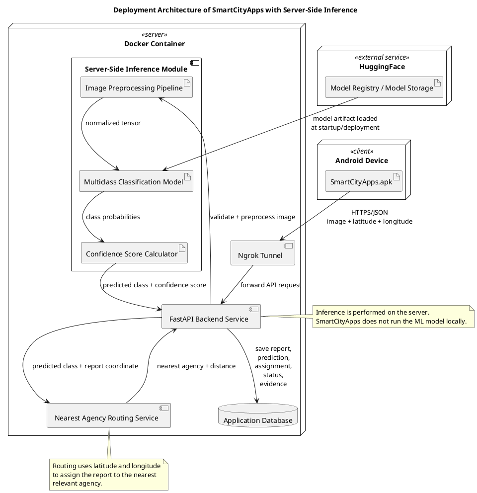
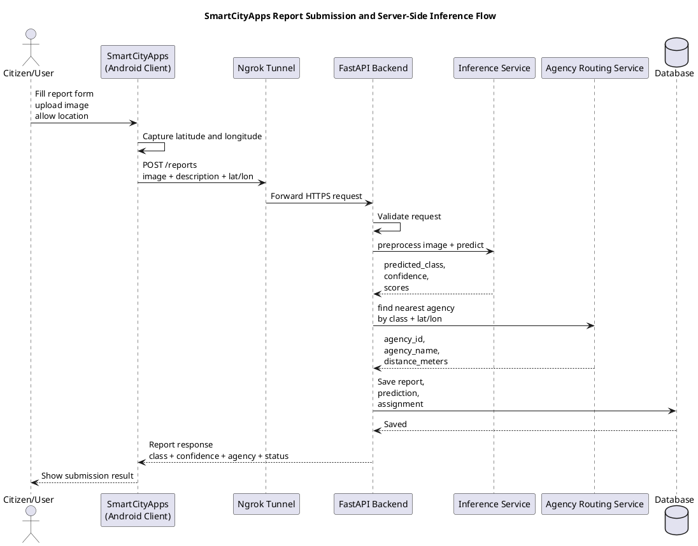
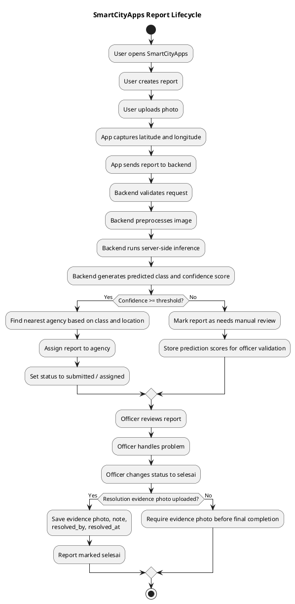
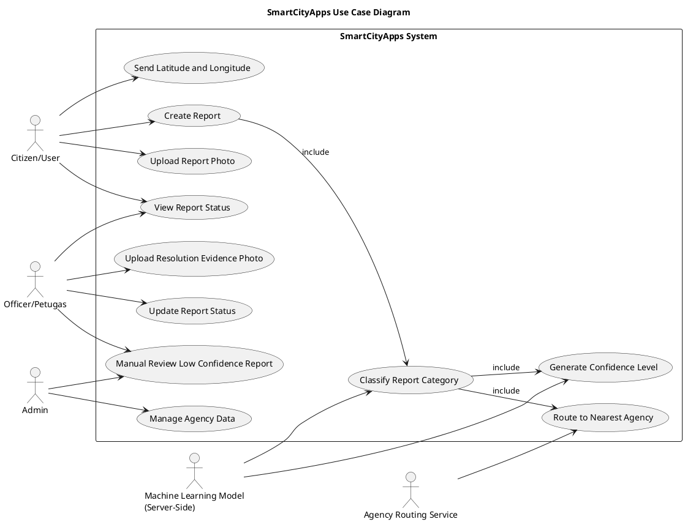
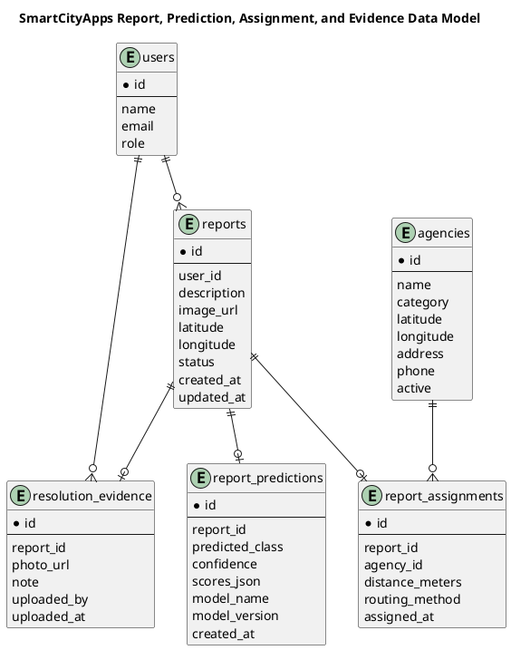

# Concrete Revision Prompt — SmartCityApps Server-Side Inference, Multiclass Confidence, Nearest Agency Routing, Evidence Upload, Code Flow, LaTeX, and Diagram Update

## Goal

Revise the `smartCityReport` project so the **code, thesis, UI, flow, database, diagrams, and experiments** are consistent with the real system architecture:

> SmartCityApps does not run the machine learning model inside the Android app. SmartCityApps sends the report image and location data to the backend. The backend performs preprocessing, multiclass model inference, confidence calculation, nearest agency routing, and stores the final report result.

Target repository:

```bash
/Users/quatumteknologinusantara/Thesis-/smartCityReport
```

Create a new branch:

```bash
git checkout -b feature/server-inference-confidence-routing-evidence
```

Do not make random rewrites. Audit the repository first, then edit the correct files.

---

## Important Naming

Use this application name consistently:

```text
SmartCityApps
```

For Android artifact naming in diagrams:

```text
SmartCityApps.apk
```

Use this wording in thesis:

```text
Aplikasi Android SmartCityApps berperan sebagai client untuk mengirimkan laporan, foto, serta koordinat latitude dan longitude. Proses inferensi model dilakukan pada sisi server melalui backend FastAPI.
```

---

# 1. Diagram Generation Approach

## Can we generate a diagram like the example?

Yes. Use **PlantUML**.

Reason:

- It supports UML-style deployment diagrams.
- It can create nodes, components, artifacts, protocols, and server/client boxes.
- It is suitable for thesis documentation.
- It can export to PNG/SVG/PDF.
- The generated image can be inserted into LaTeX using `\includegraphics`.

Recommended tool:

```text
PlantUML
```

Optional supporting tool:

```text
Graphviz
```

Use Graphviz if PlantUML layout requires it.

Install on macOS:

```bash
brew install plantuml graphviz
```

Install on Ubuntu:

```bash
sudo apt update
sudo apt install plantuml graphviz
```

Generate PNG:

```bash
plantuml -tpng docs/diagrams/deployment_server_side_inference.puml
```

Generate SVG:

```bash
plantuml -tsvg docs/diagrams/deployment_server_side_inference.puml
```

Recommended folder structure:

```text
docs/
  diagrams/
    deployment_server_side_inference.puml
    sequence_report_submission.puml
    activity_report_lifecycle.puml
    use_case_smartcityapps.puml
    erd_report_prediction_assignment.puml

thesis/
  figures/
    deployment_server_side_inference.png
    sequence_report_submission.png
    activity_report_lifecycle.png
    use_case_smartcityapps.png
    erd_report_prediction_assignment.png
```

If the thesis folder has another structure, follow the current existing structure instead of creating duplicate folders.

---

# 2. Deployment Diagram — Required Revision

Create or update this file:

```text
docs/diagrams/deployment_server_side_inference.puml
```

Use this PlantUML content:



Important diagram correction:

```text
Do not label HuggingFace as "Deployed Model" if inference is not executed there.
Use "Model Registry / Model Storage".
```

Why:

```text
If the diagram says "HuggingFace Deployed Model", examiners may think inference is executed by HuggingFace.
The correct explanation is that the model artifact can be stored or downloaded from HuggingFace, but inference runs on the backend server.
```

---

# 3. Sequence Diagram — Report Submission and Inference Flow

Create or update:

```text
docs/diagrams/sequence_report_submission.puml
```

Use this content:



---

# 4. Activity Diagram — Report Lifecycle

Create or update:

```text
docs/diagrams/activity_report_lifecycle.puml
```

Use this content:



---

# 5. Use Case Diagram — Required Update

Create or update:

```text
docs/diagrams/use_case_smartcityapps.puml
```

Use this content:



Important:

```text
The ML model actor is not the Android app.
It represents a server-side model/inference module.
```

---

# 6. ERD / Database Diagram

Create or update:

```text
docs/diagrams/erd_report_prediction_assignment.puml
```

If using SQL-style entities, use:



If using MongoDB, do not force SQL tables. Instead document embedded structure:

```json
{
  "_id": "...",
  "user_id": "...",
  "description": "...",
  "image_url": "...",
  "latitude": -6.2,
  "longitude": 106.8,
  "status": "assigned",
  "prediction": {
    "predicted_class": "road_damage",
    "confidence": 0.91,
    "scores": {
      "road_damage": 0.91,
      "garbage": 0.05,
      "street_light": 0.04
    },
    "model_name": "smartcity-multiclass-classifier",
    "model_version": "v1.0"
  },
  "assignment": {
    "agency_id": "...",
    "agency_name": "Dinas Bina Marga",
    "distance_meters": 1240,
    "routing_method": "nearest_by_category_and_location"
  },
  "resolution_evidence": {
    "photo_url": "...",
    "note": "...",
    "uploaded_by": "...",
    "uploaded_at": "..."
  }
}
```

---

# 7. Backend Code Change Checklist

First locate files:

```bash
find . -type f \( -name "*.py" -o -name "*.kt" -o -name "*.java" -o -name "*.dart" -o -name "*.js" -o -name "*.ts" -o -name "*.tsx" -o -name "*.tex" -o -name "*.bib" \) | sort
```

Search relevant code:

```bash
grep -RniE "report|laporan|predict|inference|classification|confidence|latitude|longitude|status|selesai|agency|instansi|upload|evidence|foto" . \
  --exclude-dir=.git \
  --exclude-dir=node_modules \
  --exclude-dir=venv \
  --exclude-dir=.venv
```

## Backend files that likely need editing

Adapt to actual structure:

```text
backend/app/main.py
backend/app/routers/report.py
backend/app/routers/reports.py
backend/app/services/report_service.py
backend/app/services/inference_service.py
backend/app/services/agency_routing_service.py
backend/app/models/report.py
backend/app/schemas/report.py
backend/app/repositories/report_repository.py
backend/app/repositories/agency_repository.py
backend/app/config.py
backend/app/database.py
backend/migrations/*
```

## Add / update inference service

Required behavior:

```text
- Load model at backend startup or lazy-load once.
- Preprocess uploaded image.
- Run multiclass prediction.
- Return predicted class, confidence, scores, model name, and model version.
- Do not run inference on Android.
```

Contract:

```python
class InferenceResult:
    predicted_class: str
    confidence: float
    scores: dict[str, float]
    model_name: str
    model_version: str
```

## Add / update agency routing service

Required behavior:

```text
- Input: predicted_class, latitude, longitude
- Map predicted class to agency category
- Query active agencies
- Calculate distance using Haversine
- Return nearest agency
- Fallback safely if no agency is found
```

Haversine function:

```python
from math import radians, sin, cos, sqrt, atan2

def haversine_distance_meters(lat1: float, lon1: float, lat2: float, lon2: float) -> float:
    radius = 6371000
    dlat = radians(lat2 - lat1)
    dlon = radians(lon2 - lon1)

    a = (
        sin(dlat / 2) ** 2
        + cos(radians(lat1)) * cos(radians(lat2)) * sin(dlon / 2) ** 2
    )

    c = 2 * atan2(sqrt(a), sqrt(1 - a))
    return radius * c
```

## Update create report flow

Required flow:

```text
POST /reports
  -> validate request
  -> store uploaded image
  -> run server-side inference
  -> calculate confidence
  -> route to nearest agency
  -> save report
  -> return prediction + assignment in response
```

Example response shape:

```json
{
  "id": "report-id",
  "status": "assigned",
  "image_url": "...",
  "latitude": -6.2,
  "longitude": 106.8,
  "prediction": {
    "predicted_class": "road_damage",
    "confidence": 0.91,
    "scores": {
      "road_damage": 0.91,
      "garbage": 0.05,
      "street_light": 0.04
    },
    "model_name": "smartcity-multiclass-classifier",
    "model_version": "v1.0"
  },
  "assignment": {
    "agency_id": "agency-id",
    "agency_name": "Dinas Bina Marga",
    "distance_meters": 1240,
    "routing_method": "nearest_by_category_and_location"
  }
}
```

## Confidence threshold

Add config:

```env
PREDICTION_CONFIDENCE_THRESHOLD=0.70
```

Behavior:

```text
If confidence >= threshold:
  Assign automatically to nearest relevant agency.

If confidence < threshold:
  Save prediction, but mark as needs_review/manual_review.
  Do not silently force an incorrect agency assignment.
```

---

# 8. Resolution Evidence Upload Flow

## Requirement

When report status becomes:

```text
selesai
```

The officer/petugas must upload proof that the issue has been handled.

Required fields:

```text
resolution_evidence_photo_url
resolution_note
resolved_by
resolved_at
```

## Backend API option

Use current API style. Prefer one of these:

### Option A — status update with evidence

```http
PATCH /reports/{report_id}/status
Content-Type: multipart/form-data

status=selesai
resolution_note=...
resolution_photo=<file>
```

### Option B — separate evidence endpoint

```http
POST /reports/{report_id}/resolution-evidence
Content-Type: multipart/form-data

resolution_note=...
resolution_photo=<file>
```

Preferred:

```text
If current project already has status update endpoint, use Option A.
If current project already has upload file abstraction, Option B is acceptable.
```

## Validation

Implement:

```text
- Only authorized petugas/admin can upload evidence.
- File must be image.
- File size must be limited.
- Report must exist.
- Report must be assigned to that petugas/agency or user has admin role.
- Evidence must be required before final status "selesai".
- Store resolved_by and resolved_at.
```

## Regression protection

Do not break old status transitions:

```text
submitted -> assigned
assigned -> in_progress
in_progress -> selesai
```

But enforce:

```text
in_progress -> selesai requires evidence photo
```

---

# 9. Android / SmartCityApps UI Change Checklist

Locate Android files:

```bash
find . -type f \( -name "*.kt" -o -name "*.java" -o -name "*.xml" -o -name "*.dart" -o -name "*.tsx" -o -name "*.jsx" \) | sort
```

Search:

```bash
grep -RniE "Report|Laporan|Upload|Photo|Camera|Location|Latitude|Longitude|Status|Selesai|Evidence|Prediction|Confidence|Agency|Instansi" . \
  --exclude-dir=.git \
  --exclude-dir=node_modules \
  --exclude-dir=build
```

## Report Create Screen

Update UI to show/collect:

```text
- report image
- description
- current latitude
- current longitude
- submit button
```

After submit, show result:

```text
- predicted class
- confidence percentage
- assigned agency name
- approximate distance
- status
```

Example UI copy:

```text
Kategori laporan terdeteksi: Kerusakan Jalan
Confidence: 91%
Diarahkan ke: Dinas Bina Marga
Jarak estimasi: 1.24 km
Status: Assigned
```

## Report Detail Screen

Show:

```text
- report image
- description
- status
- predicted class
- confidence level
- assigned agency
- evidence photo if status selesai
```

## Officer Status Update Screen

When officer selects:

```text
selesai
```

Show required form:

```text
- upload resolution photo
- resolution note
- submit
```

Validation:

```text
- If status is selesai and photo is empty, show error.
- Do not call API until photo exists.
```

Example UI copy:

```text
Upload foto bukti penyelesaian wajib diisi sebelum laporan dapat ditandai selesai.
```

---

# 10. Thesis / LaTeX Revision Checklist

Locate thesis files:

```bash
find . -type f \( -name "*.tex" -o -name "*.bib" -o -name "*.cls" -o -name "*.sty" \) | sort
```

Search:

```bash
grep -RniE "Android|model|inference|inferensi|classification|klasifikasi|confidence|latitude|longitude|instansi|agency|selesai|bukti|foto|diagram|use case|deployment" . \
  --include="*.tex" \
  --include="*.bib"
```

## Required thesis explanation

Add a section in Bab 3, for example:

```latex
\subsection{Arsitektur Server-Side Inference}

Pada sistem yang dikembangkan, proses inferensi model tidak dilakukan pada perangkat Android, melainkan pada sisi server melalui layanan backend berbasis FastAPI. Aplikasi Android SmartCityApps berperan sebagai client untuk mengirimkan laporan berupa gambar, deskripsi, serta koordinat lokasi berupa latitude dan longitude. Data tersebut dikirimkan ke server melalui request API.

Setelah request diterima oleh backend, sistem melakukan validasi data, preprocessing gambar, dan menjalankan proses inferensi menggunakan model machine learning yang telah dimuat pada server. Hasil inferensi berupa kelas prediksi permasalahan, nilai confidence, serta skor probabilitas setiap kelas digunakan untuk menentukan kategori laporan.

Selain menghasilkan prediksi multiclass, backend juga memanfaatkan informasi latitude dan longitude untuk mengarahkan laporan kepada instansi terdekat yang relevan dengan kategori permasalahan. Dengan pendekatan ini, perangkat Android tidak perlu menjalankan model secara lokal sehingga beban komputasi pada perangkat pengguna menjadi lebih ringan. Pembaruan model juga dapat dilakukan secara terpusat pada server tanpa mewajibkan pengguna memperbarui aplikasi Android.

Model yang digunakan dapat disimpan sebagai artefak pada server atau pada model registry seperti HuggingFace. Namun, proses inferensi tetap dilakukan pada backend server, bukan pada perangkat Android maupun langsung pada HuggingFace.
```

## Add confidence explanation

```latex
\subsection{Output Inferensi dan Confidence Level}

Output dari proses inferensi terdiri dari kelas prediksi, nilai confidence, dan skor probabilitas pada setiap kelas. Kelas prediksi menunjukkan jenis permasalahan yang terdeteksi dari gambar laporan, sedangkan confidence menunjukkan tingkat keyakinan model terhadap hasil prediksi tersebut.

Nilai confidence digunakan sebagai indikator pendukung dalam proses pengambilan keputusan. Jika nilai confidence berada di atas threshold yang telah ditentukan, laporan dapat diarahkan secara otomatis ke instansi terkait berdasarkan kategori dan lokasi terdekat. Namun, apabila nilai confidence berada di bawah threshold, laporan dapat ditandai untuk validasi manual oleh petugas agar mengurangi risiko kesalahan klasifikasi.
```

## Add nearest agency routing explanation

```latex
\subsection{Routing Laporan Berdasarkan Lokasi dan Kategori}

Setelah sistem memperoleh hasil klasifikasi, backend menentukan instansi tujuan berdasarkan kategori laporan dan koordinat lokasi pengguna. Koordinat latitude dan longitude dari laporan digunakan untuk menghitung jarak antara lokasi laporan dan lokasi instansi yang relevan.

Perhitungan jarak dapat dilakukan menggunakan formula Haversine karena koordinat yang digunakan berada pada permukaan bumi. Instansi dengan kategori yang sesuai dan jarak terdekat akan dipilih sebagai tujuan laporan. Hasil routing yang disimpan meliputi identitas instansi, nama instansi, jarak estimasi, dan metode routing yang digunakan.
```

## Add resolution evidence explanation

```latex
\subsection{Bukti Penyelesaian Laporan}

Pada tahap penyelesaian laporan, petugas diwajibkan mengunggah foto bukti penyelesaian ketika status laporan diubah menjadi selesai. Foto bukti ini digunakan untuk menunjukkan bahwa permasalahan yang dilaporkan telah ditangani. Selain foto, petugas juga dapat menambahkan catatan penyelesaian.

Data bukti penyelesaian disimpan bersama metadata laporan, seperti petugas yang mengunggah bukti dan waktu penyelesaian. Dengan adanya bukti penyelesaian, sistem memiliki jejak audit yang lebih jelas dan dapat meningkatkan transparansi proses penanganan laporan.
```

---

# 11. LaTeX Figure Include Example

After generating PNG files using PlantUML, include them in LaTeX.

Example:

```latex
\begin{figure}[H]
    \centering
    \includegraphics[width=0.95\textwidth]{figures/deployment_server_side_inference.png}
    \caption{Deployment Diagram SmartCityApps dengan Server-Side Inference}
    \label{fig:deployment-server-side-inference}
\end{figure}
```

For sequence diagram:

```latex
\begin{figure}[H]
    \centering
    \includegraphics[width=0.95\textwidth]{figures/sequence_report_submission.png}
    \caption{Sequence Diagram Proses Pengiriman Laporan dan Inferensi Server-Side}
    \label{fig:sequence-report-submission}
\end{figure}
```

For activity diagram:

```latex
\begin{figure}[H]
    \centering
    \includegraphics[width=0.95\textwidth]{figures/activity_report_lifecycle.png}
    \caption{Activity Diagram Siklus Hidup Laporan pada SmartCityApps}
    \label{fig:activity-report-lifecycle}
\end{figure}
```

For use case:

```latex
\begin{figure}[H]
    \centering
    \includegraphics[width=0.95\textwidth]{figures/use_case_smartcityapps.png}
    \caption{Use Case Diagram SmartCityApps}
    \label{fig:use-case-smartcityapps}
\end{figure}
```

For ERD/database diagram:

```latex
\begin{figure}[H]
    \centering
    \includegraphics[width=0.95\textwidth]{figures/erd_report_prediction_assignment.png}
    \caption{Struktur Data Laporan, Prediksi, Penugasan Instansi, dan Bukti Penyelesaian}
    \label{fig:erd-report-prediction-assignment}
\end{figure}
```

---

# 12. Section 3.16 UI Screenshots Rule

For section 3.16.1 until 3.16.7, do not overload the main chapter with too many screenshots.

Use concise explanation:

```latex
\subsection{Tampilan Halaman Pengiriman Laporan}

Halaman pengiriman laporan digunakan oleh pengguna untuk mengunggah foto permasalahan, mengisi deskripsi laporan, dan mengirimkan koordinat lokasi berupa latitude dan longitude. Setelah laporan dikirimkan, sistem menampilkan hasil klasifikasi, confidence level, serta instansi tujuan yang dipilih berdasarkan kategori dan lokasi. Tampilan lengkap halaman ini dapat dilihat pada Lampiran~\ref{lampiran:ui-smartcityapps}.
```

Use this pattern for each UI subsection:

```text
- explain purpose
- explain important fields
- explain relation to backend flow
- say full image can be seen in appendix
```

Example sentence:

```latex
Tampilan lengkap antarmuka pengguna dapat dilihat pada lampiran agar pembahasan pada bab utama tetap berfokus pada alur sistem dan fungsi utama aplikasi.
```

---

# 13. Notebook / Experiment Revision

Locate notebooks:

```bash
find . -type f \( -name "*.ipynb" -o -name "*.py" \) | grep -Ei "notebook|experiment|train|model|classification|eval|predict"
```

Required checks:

```text
- Is the model actually multiclass?
- What are the class names?
- Does the notebook output probability/confidence?
- Does the notebook include evaluation metrics?
- Does the confusion matrix match the thesis?
- Does the thesis claim match the experiment?
```

Required experiment outputs:

```text
- accuracy
- precision
- recall
- F1-score
- confusion matrix
- per-class performance
- confidence output example
- inference example with image
```

If not available, add an experiment script or notebook cell.

Do not fake values in thesis.

---

# 14. Reference / Bibliography Rule

Update references so they are mostly recent.

Requirement:

```text
Use references from the last 5 years from 2026.
Target range: 2021–2026.
For article/news/context references: November 2025–April 2026 if available.
```

Important correction:

```text
DINOv2 is not a 2016 paper.
DINOv2 was released in 2023.
```

Use:

```text
- Original DINOv2 paper if relevant.
- Newer papers that cite/use DINOv2 if the thesis needs more recent support.
- Recent smart city / computer vision / report routing / mobile reporting references.
```

Do not cite old papers unless:

```text
- it is a foundational method, or
- no newer replacement exists, or
- the methodology requires historical comparison.
```

---

# 15. Testing Checklist

Backend tests:

```text
- create report with image + latitude + longitude
- inference returns predicted class and confidence
- confidence below threshold marks report as manual review
- nearest agency selected correctly
- no matching agency does not crash
- status selesai requires resolution photo
- evidence upload stores photo_url, uploaded_by, uploaded_at
- unauthorized user cannot upload evidence
```

Android/UI tests or manual QA:

```text
- user can submit report
- app sends latitude and longitude
- app displays predicted class
- app displays confidence percentage
- app displays assigned agency
- officer cannot set selesai without evidence photo
- officer can upload evidence photo successfully
- report detail shows evidence after completion
```

Regression tests:

```text
- existing login still works
- existing report list still works
- existing report detail still works
- existing image upload still works
- existing status update flow still works except new evidence requirement for selesai
```

---

# 16. Final Deliverables

After implementation, produce this report:

```text
docs/revision-audit/final_change_report.md
```

Must contain:

```md
# Final Change Report

## Summary
- ...

## Code Files Changed
- ...

## Database / Migration Changes
- ...

## API Changes
- ...

## Android UI Changes
- ...

## Diagram Files Added / Updated
- ...

## Thesis / LaTeX Files Changed
- ...

## Experiment / Notebook Changes
- ...

## Regression Tests Performed
- ...

## Remaining Risks
- ...
```

---

# 17. Acceptance Criteria

The revision is accepted only if:

```text
- Thesis states clearly that inference happens on backend server.
- Deployment diagram shows FastAPI server-side inference.
- HuggingFace is described as model registry/storage, not direct inference endpoint.
- SmartCityApps is shown as Android client only.
- Multiclass prediction returns class + confidence.
- Report response includes assigned agency based on location.
- Officer must upload resolution evidence photo for status selesai.
- Database stores prediction, assignment, and evidence.
- Use case, sequence, activity, deployment, and ERD diagrams are consistent.
- UI section 3.16.1–3.16.7 points full screenshots to appendix.
- No regression in existing report creation, status, auth, and upload flows.
```
